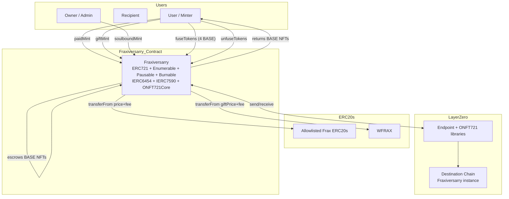
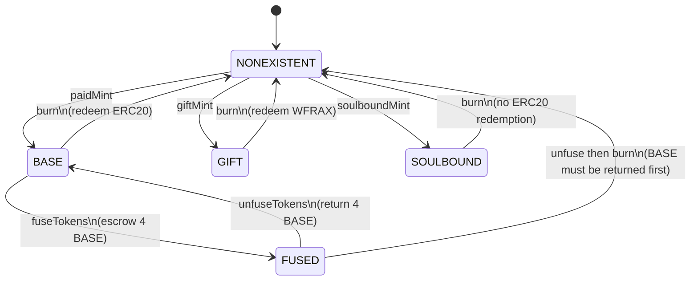
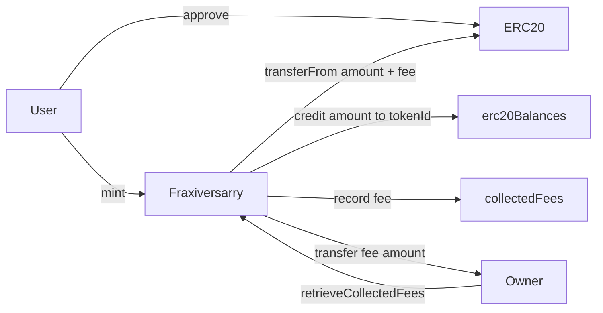
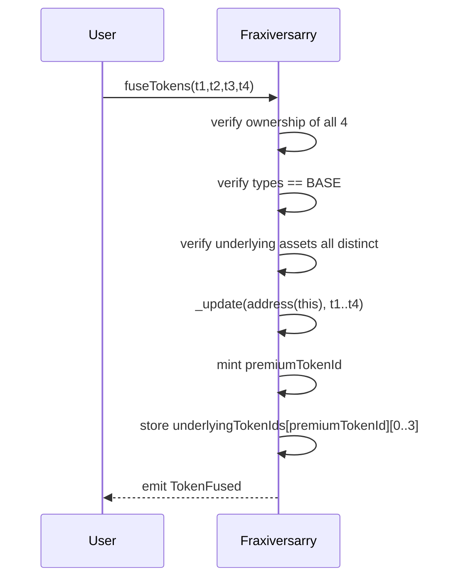
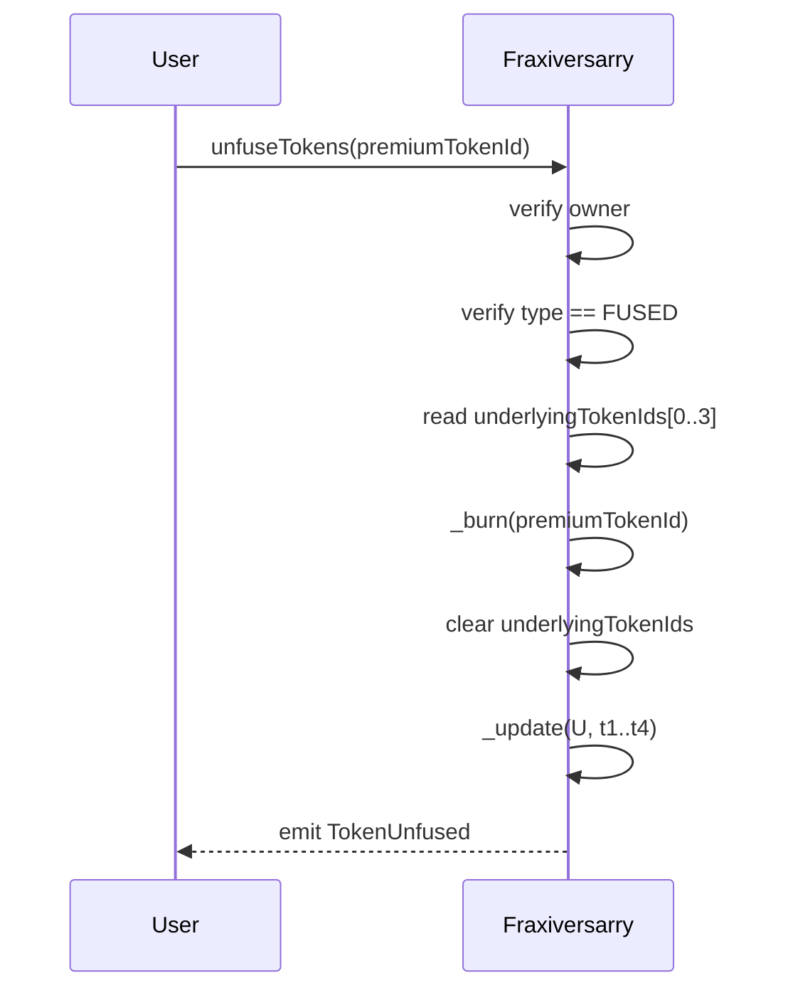
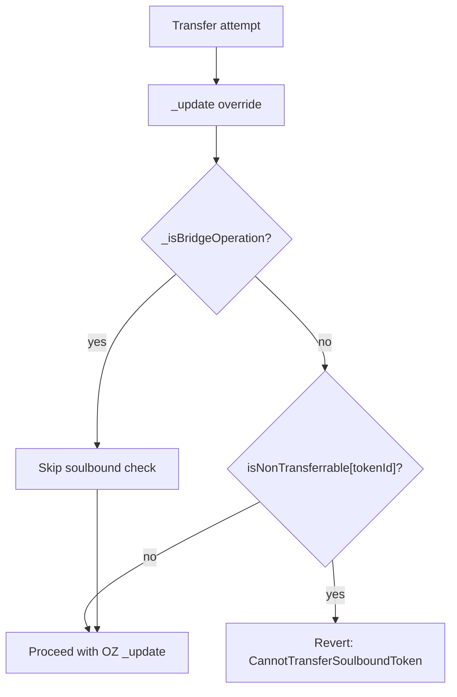
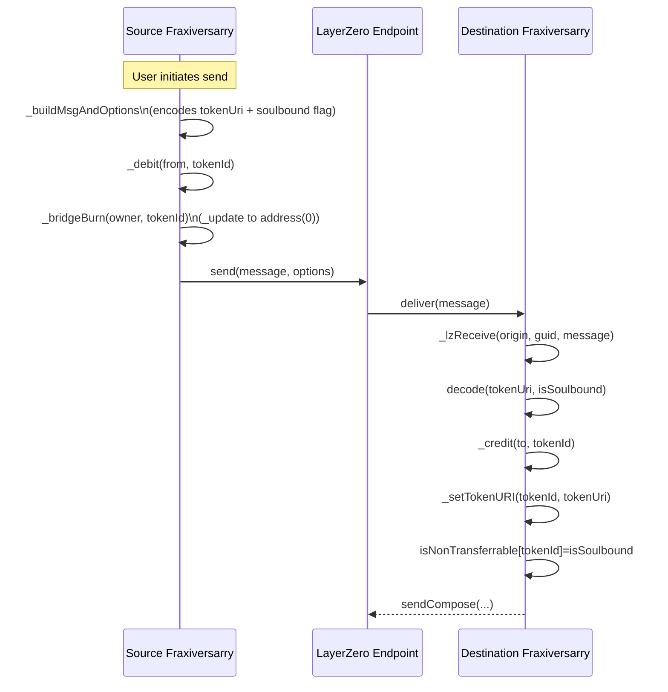

# Fraxiversarry

A composable, ERC20-backed, cross-chain ERC721 collection for the Frax ecosystem intended to commemorate the 5th anniversary of Frax Finance.

## High-level overview

Fraxiversarry is an ERC721-based collection with four core behaviors:

1. **BASE minting**
   - Users mint NFTs by paying with an allowlisted Frax ERC20.
   - The contract records an **internal balance** for the new tokenId.

2. **GIFT minting**
   - Users mint NFTs for a recipient by paying a fixed WFRAX price.
   - GIFT tokens have their **own supply range**.

3. **SOULBOUND minting**
   - Owner-only mints for curated distribution.
   - Marked non-transferable via `IERC6454` semantics.
   - Not treated as ERC20-backed positions.

4. **FUSION**
   - Owners can fuse **four distinct BASE tokens** into one premium FUSED token.
   - The four BASE tokens are escrowed by the contract.
   - Unfusing burns the FUSED token and returns the originals.

Additionally, the collection supports **cross-chain transfers** using
LayerZero’s **ONFT721** pattern. Soulbound rules are enforced consistently
across local transfers and bridging flows, with a bridge-aware bypass that
prevents normal transfers while still allowing ONFT debit/credit operations.

---

## Token metadata

Token metadata contains information that allows the UIs to display tokens properly. It also includes the link to the image representing the token.

- BASE WFRAX token: [https://arweave.net/](https://arweave.net/)
- BASE sfrxUSD token: [https://arweave.net/VAk7sIe36qVGS80TCBqctI1pZJbwDzx6KytRA5l6VhE](https://arweave.net/VAk7sIe36qVGS80TCBqctI1pZJbwDzx6KytRA5l6VhE)
- BASE sfrxETH token: [https://arweave.net/Rzs5IiJpVPKIPRHgqmqDhDKikt_miLqJKYTPBEkUSzw](https://arweave.net/Rzs5IiJpVPKIPRHgqmqDhDKikt_miLqJKYTPBEkUSzw)
- BASE FPI token: [https://arweave.net/](https://arweave.net/)
- FUSED token: [https://arweave.net/](https://arweave.net/)
- GIFT token: [https://arweave.net/](https://arweave.net/)

---

## Architecture map



---

## Token ID ranges

The contract allocates distinct ID ranges:

- **BASE tokens:**  
  `0 ... mintingLimit - 1`

- **GIFT tokens:**  
  `mintingLimit ... mintingLimit + giftMintingLimit - 1`

- **Premium tokens (FUSED + SOULBOUND):**  
  start at  
  `mintingLimit + giftMintingLimit`  
  and grow upward.

---

## Token types

```solidity
enum TokenType {
    NONEXISTENT,
    BASE,
    FUSED,
    SOULBOUND,
    GIFT
}
```

### BASE
- Minted with an allowlisted Frax ERC20.
- Backed by a **single recorded underlying ERC20**.
- The deposit (excluding fee) is credited to:
  - `erc20Balances[tokenId][erc20]`
  - and the underlying ERC20 address is stored in `underlyingAssets[tokenId][0]`.

### GIFT
- Minted with **WFRAX**.
- Separate supply and default URI.
- Same accounting model as BASE but with fixed asset = WFRAX.

### SOULBOUND
- Minted only by owner.
- Marked non-transferable:
  - `isNonTransferrable[tokenId] = true`
  - `tokenTypes[tokenId] = SOULBOUND`
- Treated as **non-ERC20-backed** from a UI perspective:
  - `getUnderlyingBalances` returns empty arrays.

### FUSED
- Created by fusing **four BASE tokens** owned by the caller.
- All four BASE tokens must have **distinct underlying ERC20 assets**.
- The BASE tokens are transferred into contract custody.
- The new FUSED token stores:
  - `underlyingTokenIds[premiumTokenId][0..3]`.

---

## Lifecycle state machine



> Note: The actual implementation marks types as `NONEXISTENT` after burn.
> The "FUSED -> BASE" arrow in the diagram describes the conceptual
> effect of *unfusing* (the BASE tokens become user-owned again).

---

## ERC20 tokenization model (IERC7590-like semantics)

Fraxiversarry tracks ERC20 deposits using internal accounting:

- `erc20Balances[tokenId][erc20]`
- `underlyingAssets[tokenId][index]`
- `numberOfTokenUnderlyingAssets[tokenId]`
- `transferOutNonces[tokenId]`

### Deposit rules
- Allowed only during mint flows:
  - `paidMint`
  - `giftMint`
- The external `IERC7590` deposit function intentionally reverts:
  - `TokensCanOnlyBeDepositedByNftMint()`.

### Withdrawal rules
- Allowed only via `burn`.
- The external `IERC7590` withdrawal function intentionally reverts:
  - `TokensCanOnlyBeRetrievedByNftBurn()`.

### Accounting & fee model
- When minting:
  - User pays `amount + fee`.
  - `amount` is credited to the token’s internal balance.
  - `fee` is accumulated in `collectedFees[erc20]`.



---

## Minting

### BASE minting (`paidMint`)
Requirements:
- `block.number <= mintingCutoffBlock`
- `nextTokenId < mintingLimit`
- `mintPrices[erc20] != 0`

Effects:
- Transfers `mintPrice + fee` from minter.
- Credits internal ERC20 balance.
- Sets token type to `BASE`.
- Sets token URI from `baseAssetTokenUris[erc20]`.

### GIFT minting (`giftMint`)
Requirements:
- `block.number <= mintingCutoffBlock`
- `nextGiftTokenId < mintingLimit + giftMintingLimit`

Effects:
- Transfers `giftMintingPrice + fee` in WFRAX from minter.
- Mints to `_recipient`.
- Sets token type to `GIFT`.
- Uses `giftTokenUri`.

### SOULBOUND minting (`soulboundMint`)
Owner-only.
- Mints in the premium range.
- Uses a **custom URI** provided at mint time.

---

## Fusion

### Fuse flow



### Unfuse flow



---

## Soulbound enforcement (IERC6454)

Transferability is controlled through:
- `isNonTransferrable[tokenId]`
- `_soulboundCheck(tokenId)`
- overridden `_update`.

**Rule:**
- A soulbound token is not transferable in normal ERC721 flows.
- The check is **bypassed temporarily** during bridge operations
  using `_isBridgeOperation`.



---

## Cross-chain behavior (LayerZero ONFT721)

Fraxiversarry extends `ONFT721Core`.

### Outbound (source chain)
- `_debit(from, tokenId, ...)`
  - validates approval semantics
  - calls `_bridgeBurn(owner, tokenId)`
  - which uses `_update(address(0), tokenId, owner)` while
    `_isBridgeOperation = true`.

### Inbound (destination chain)
- `_lzReceive` decodes a **composed message** that contains:
  - `tokenUri`
  - `isSoulbound`
- Calls `_credit(to, tokenId, ...)`
- Restores:
  - `tokenTypes` (implicitly via existing storage)
  - `isNonTransferrable[tokenId]`
  - `tokenURI(tokenId)`.



---

## Metadata strategy (IERC4906)

The contract emits:
- `MetadataUpdate(tokenId)`
- `BatchMetadataUpdate(first, last)`

Admin functions allow refreshing URIs for:
- BASE range
- GIFT range
- premium range

This supports indexer-friendly updates without changing token logic.

---

## Admin surface

Owner-controlled functions include:

- pricing & allowlist
  - `updateBaseAssetMintPrice`
  - `updateGiftMintingPrice`
  - `updateMintingFeeBasisPoints`
  - `updateMintingCutoffBlock`

- URI management
  - `setBaseAssetTokenUri`
  - `setGiftTokenUri`
  - `setPremiumTokenUri`
  - `refreshBaseTokenUris`
  - `refreshGiftTokenUris`
  - `refreshPremiumTokenUris`
  - `updateSpecificTokenUri`

- protocol controls
  - `pause`
  - `unpause`
  - `retrieveCollectedFees`

---

## Events (summary)

- `MintPriceUpdated`
- `GiftMintPriceUpdated`
- `MintingFeeUpdated`
- `MintingCutoffBlockUpdated`
- `FeeCollected`
- `FeesRetrieved`
- `GiftMinted`
- `NewSoulboundToken`
- `TokenFused`
- `TokenUnfused`

---

## Errors (summary)

The errors are designed to be explicit and cheap:
- minting bounds
- allowlist failures
- soulbound violations
- fusion invariants
- ERC20 accounting constraints

---

## Security and invariants

Key intended invariants:

1. **No arbitrary ERC20 movement**
   - Deposits only during mint.
   - Withdrawals only during burn.

2. **Fee isolation**
   - Fees are tracked separately from token balances in `collectedFees`.
   - Owner can sweep only the fee bucket, not user-backed balances.

3. **Fusion uniqueness**
   - Underlying ERC20 assets for the four BASE tokens must be distinct.

4. **Bridge-aware soulbound**
   - Standard transfers respect soulbound rules.
   - ONFT debit/credit is allowed to preserve UX and cross-chain supply integrity.

---

## Integration notes

### Wallet & UI
- For BASE/GIFT tokens:
  - show ERC20 backing using `getUnderlyingBalances`.
- For SOULBOUND:
  - expect empty backing arrays (by design).
- For FUSED:
  - derive backing from underlying BASE composing tokens.

### Indexers
- Watch for:
  - `MetadataUpdate`
  - `BatchMetadataUpdate`
  - fusion events
  - burn events

---

## Developer workflow

Recommended checks:
- `forge build`
- `forge build --sizes --skip test --skip script`
- `forge test`
- `forge fmt`
- `forge coverage --report lcov --ir-minimum && genhtml -o report ./lcov.info`
- static analysis for:
  - mint bounds
  - fusion/unfusion ordering
  - bridge message decoding
  - ERC20 fee accounting

---

## Diagram index

This README includes:
- **Architecture map** (flowchart)
- **Token ID range explanation**
- **Lifecycle state machine**
- **ERC20 fee and accounting flow**
- **Soulbound enforcement flow**
- **Fusion / Unfusion sequence diagrams**
- **Bridge (ONFT) sequence diagram**

---

## License

MIT.
